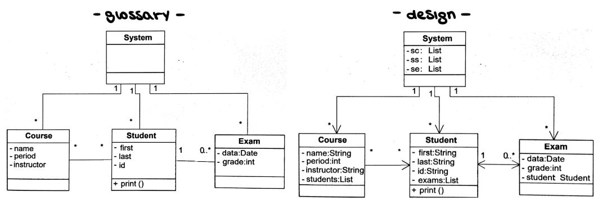
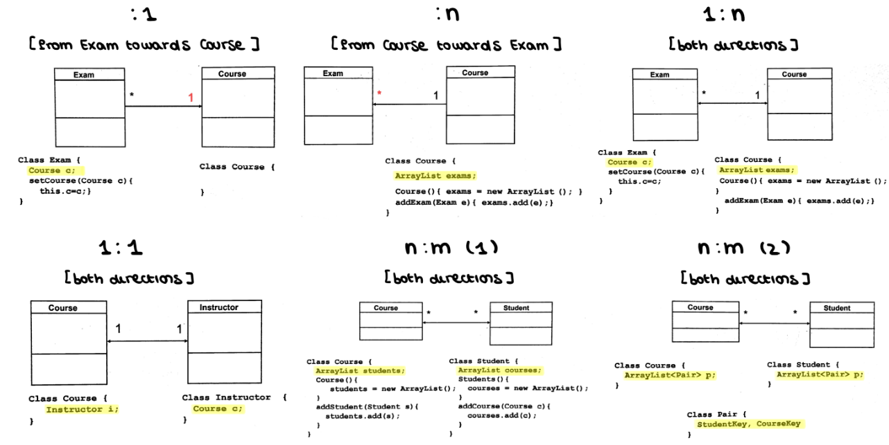
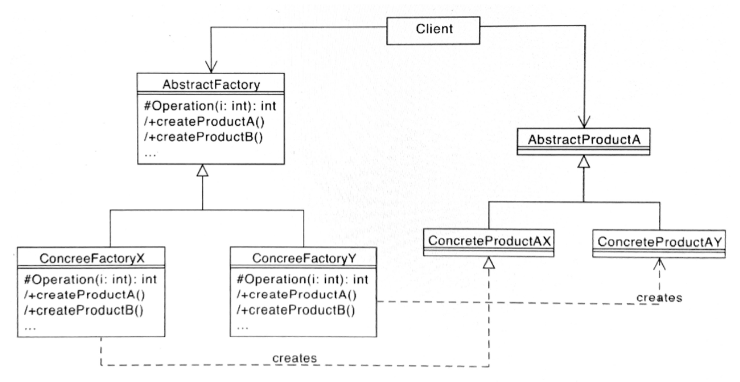
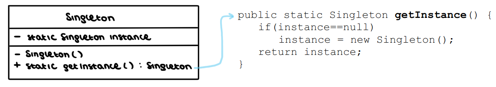

# All about Design
_Want to know more? Read [design.pdf](./design.pdf)_

## First, some stuff about C++ specifiers
### Access specifiers
In C++, there are three access specifiers:
- `public` = members are accessible from outside the class.
- `private` = members cannot be accessed (or viewed) from outside the class.
- `protected` = members cannot be accessed from outside the class. However, they can be accessed in inherited classes.

```cpp
class MyClass {
  public:    // Public access specifier
    int x;   // Public attribute
  private:   // Private access specifier
    int y;   // Private attribute
};

int main() {
  MyClass myObj;
  myObj.x = 25;  // Allowed (public)
  myObj.y = 50;  // Not allowed (private)
  return 0;
}
```

### Static attribute
A `static` attribute is an attribute that is shared by all the instances of a class.

Given this class:
```cpp
class MyClass {
public:
    // Static data member
    static int i;

    MyClass(){};    // do nothing
};
```

```cpp
// WRONG
int main() {
    MyClass obj1;
    MyClass obj2;
    obj1.i = 2;
    obj2.i = 3;

    cout << obj1.i << " " << obj2.i;
}
```
Trying to assign a value to `obj1.i` will result in an error, since `i` does not belong to a specific object, but to the whole class.

```cpp
// THIS IS HOW IT SHOULD BE DONE
int MyClass::i = 1;

int main() {
    cout << MyClass::i; // 1
}
```
Overall, a static attribute can be seen as a sort of global variable in the scope of a given class.

### Static function
The `static` specifier can also be used in member function. Similarly to the attribute case, a static function doesn't depend on the content of a specific instance, and therefore CANNOT ACCESS attributes that are not `static` as well.

We can modify the previous class:
```cpp
class MyClass {
public:
    // Static data member
    static int i;

    MyClass(){};    // do nothing

    static void print_i() {
        // print the content of static variable i
        cout << "The counter value is " << i;
    }
};
```
and then:
```cpp
int main() {
    MyClass::print_i(); // The counter value is 1
}
```
Static functions are typically used as helper functions or to interact with static attributes.

## Design? I though fashion week was passed already!
First, we talk about some keywords:
- **Requirements** = what the system/sw should do (usually there is some guy telling us the expected behaviour. The guy is also paying us, so better make him happy);
- **Architecture / Design** = how the system should be built (this is up to us!). Architecture is high level (decide major components and how they communicate---e.g., client/server), design is low level (decide the internal of each component).

From now on, we'll focus on design only. Look at the [pdf](./design.pdf) to know more about architecture.

Design comes before coding: if we start coding directly we make _implicit_ design choices, without the chance to evaluate them early on. And if the late evaluation goes wrong, we have to start from scratch (very bad!!).

The design process works with a top-to-bottom strategy:
1. **High level** (multiple classes) --- define classes and their interaction, using _design patterns_.
2. **Low level** (single class) --- focus on the behaviour of a class at a time.

Every design has functional and non-functional properties:
- Functional properties: which functionalities are offered by classes.
- Non-functional properties: everything else (e.g., performance, maintainability, portability, scalability...).

In general, we want a design that is simple (KISS principle), and with low coupling (dependency between components as low as possible).

## Basic design
Starting from a UML glossary, we get a design as follows:
- For each attribute, define type and privacy (better private, so that coupling is reduced).
- For each method, define return type, parameters, and privacy.
- Define getters and setters (only if needed!!).
- For each method, choose algorithms (if needed).
- For each relationship with other classes, choose the implementation (reference, array, map).





Notice that n:m(2) is better than n:m(1) in terms of consistency management.

## Creational patterns

### Abstract factory
**Context ->** a family of related classes can have different implementation details (e.g., creating different windows for a GUI according to the OS).

**Problem ->** the client should not know anything about which variant they are using.

**💡 Solution ->** the client interacts with abstract entities, which will then specialize in different, concrete entities. 



### Singleton 
**Context ->** a class represents a concept that requires a single instance (e.g., a counter).

**Problem ->** there is no guarantee that clients will use the class in the proper way.

**💡 Solution ->** we hide the constructor of the class (by declaring it private or protected), and then we define a public static operation, which returns the only instance of the class.



**Context ->** 

**Problem ->** 

**💡 Solution ->**


**Context ->** 

**Problem ->** 

**💡 Solution ->**