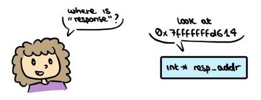
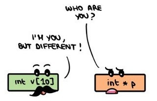

# Part 1
Hello and welcome to the C insanity! I love this language and I hope you will, too!

## TOC
1. [Differences wrt Python](#1-differences-wrt-python)
2. [Basic types and variable scope](#2-basic-types-and-variable-scope)
3. [Compiling and debugging](#3-compiling-and-debugging)
4. [Pointers](#4-pointers)
5. [Static arrays and strings](#5-static-arrays-and-strings)
6. Dynamic arrays with `malloc`

## 1. Differences wrt Python
C and Python are quite different, duh. More specifically:
- C is more low level, meaning that some stuff you do in 1 Python line takes 3 hours in C (fun!)
- C is _compiled_, while Python is interpreted. This means C needs to be, well, compiled (more on this later). This also means it's way faster to run than Python.
- C is a pure _procedural_ language, so forget about objects (you can still try to emulate object programming in C, tho)
- C is a _weakly typed_ language (more on this later)

### C syntax stuff
After every instruction you need to add a `;`. If you forget it, the compiler will complain. Blocks of code are determined by using curly brackets instead of indentation. 

You get the same constructs of Python (if, for, while), with the following differences:
- *__NO for each!__* : Too high level, forget about it.
- *__do...while__* : A variation of while where the first iteration is always executed, no matter the condition.
- *__switch...case__* : The supreme selection thing. When I discovered Python didn't have it I had a stroke.

> See this stuff in action in [c-vs-py.c](./c-vs-py.c)!

## 2. Basic types and variable scope
Here we talk about types and variable!

### Types
I said that C is a _weakly typed_ language. What does this mean? 

Well, _typed_ means that every variable is associated to a type. Before being used, variables must be _declared_, meaning you must give them a name and a type. Types are many: `int`, `float`, `char` are just a few examples. You can also create your own types! (more on this later).

_Weakly_ means that you can do whatever you want with these types, and convert each type into another. This is called a _cast_. Casting a variable (ie, changing its type) is dangerous because there are *__FEW TO NO RULES__*, 
and, in any case, you can always avoid them. This could be confusing in the beginning, but you'll get use to it.
```c
// casting a char to an int
char c = 'B';
int c_int = (int)c;

printf("Char: %c\nHex value: %#x\n", c, c_int);
// Char: B
// Hex value: 0x42
```

Before casting, it's important to know the size of the variables, because if you cast a larger variable into a smaller one you'll make a real mess (usually). This can be done with the `sizeof()` function.

### Scope
When you declare a variable, you must keep in mind that it will exist only in a specific portion of the code. That portion is called _scope_, and it's usually delimited by curly brackets. If you attempt to call a variable outside its scope, the compiler will kidnap your mum.

```c
int v1 = 0;
if (v1 == 0) {
    char v2 = 'A';
    // here v1 exists
}
// v1 still exists
// v2 doesn't exist anymore :(
```

## 3. Compiling and debugging

### Compiling
I spoke a lot about the C compiler. Let's look into it.

To compile a single file program, you can run
```sh
gcc -o <program> <program.c> 
```
If you have multiple files, it's better to write a Makefile (spoiler for next lessons).

The compiler has a bunch of useful options (I don't even know 1/4 of them). These are some you might like:
- `-g` to keep debug symbols (more on this later);
- `-O` to handle optimization.

There are many optimization levels:
- `-O0` : No optimization;
- `-O1` : Minimal optimizations which don't increase compilation time;
- `-O2` : More aggressive optimizations that improve performance without excessively increasing executable size or compilation time [used for production builds];
- `-O3` : All the possible optimization, thus reducing compilation time and executable size;
- `-Os` : Reduce the executable size as much as possible (*__sometimes very useful for embedding systems!!__*);

### Debugging
The most C relatable experience is getting a segmentation fault out of nowhere and being lost. This is where the lovely `gdb` debugger comes in! 

> Since vanilla `gdb` is a bit overwhelming, I recommend [`gef`](https://github.com/hugsy/gef).

Some useful commands:
- `gdb <program>` : starts the debugger
- `b` : places a breakpoint. Examples - `b <function>`, `b <file>:<line>`, `b *0x<address>`.
- `run <program arguments>` : starts the program
- `n` : executes next line
- `ni` : executes next program instruction
- `c` : continues until a breakpoint is met
- `p <variable>` : print variable content

## 4. Pointers
This is where it gets real dirty real fast. 

### The easy stuff
Up to now, we considered a bunch of variables. These variables are saved somewhere in memory, meaning they have an _address_. The address of a variable can be accessed via the `&` symbol.
```c
int response = 42;
printf("The response is %d and lies at address %p\n", response, &response);
// The response is 42 and lies at address 0x7fffffffd614
```
Addresses can be saved in special typed variables, called _pointers_.
```c
int response = 42;
int *resp_addr = &response;
printf("The response is %d and lies at address %p\n", response, resp_addr);
// The response is 42 and lies at address 0x7fffffffd614
```
A pointer to nothing is set to `NULL`.

Since pointers are just addresses, every pointer has the same size, even though the pointed variables have different sizes.
```c
int v1 = 42;
double v2 = 3.14159265;
printf("v1 is an int and has size %ld\n", sizeof(v1));
printf("v2 is a double and has size %ld\n", sizeof(v2));
printf("********************\n");
printf("&v1 is an int* and has size %ld\n", sizeof(&v1));
printf("&v2 is a double* and has size %ld\n", sizeof(&v2));
// v1 is an int and has size 4
// v2 is a double and has size 8
// ********************
// &v1 is an int* and has size 8
// &v2 is a double* and has size 8
```
Pretty cool, right? This is just the beginning.

> Try this stuff with [pointers.c](./pointers.c)!

### The less-easy stuff
Overall, a pointer is like a treasure map.



To use it, you need the _dereference operator_, `*`.
```c
void find_treasure(int *map) {
    printf("I found the treasure! It's %d\n", *map);
}
// in main()
int treasure = 42;
int *map = &treasure;
find_treasure(map);
// find_treasure(&treasure) works, too
```
`find_treasure` doesn't know the content of the `treasure` variable, because it's outside its scope (remember him?). However, it can still see its content thanks to the pointer!

Now look at this:
```c
void steal_treasure(int treasure) {
    treasure = 0;
    printf("The treasure is mine, muhahaha! %d\n", treasure);
}
void steal_treasure_fr(int *map) {
    *map = 0;
    printf("The treasure is mine fr, muhahaha! %d\n", *map);
}
// in main()
int treasure = 42;
steal_treasure(treasure);
printf("treasure = %d\nYou did nothing, you loser! lol\n", treasure);
// treasure = 42
steal_treasure_fr(&treasure);
printf("treasure = %d\nOps, you took it :(\n", treasure);
// treasure = 0
```
This silly example is actually very useful, because it explains how function parameters work in C. Whenever you call a function, its parameters are _copied_. This means that, if you modify them inside the function, you are just touching the copies, and the originals remain unchanged (`steal_treasure`).

However, if you pass the pointer of a variable, and then use it to change the variable inside the function with `*`, you'll modify the original variable! *__BIG CARREFOUR__* with this, it should be used only if necessary (it's better to copy and return).

> See this in [treasure.c](./treasure.c)! <br>
Bonus : use `gdb` to prove that the `treasure` variable in `steal_treasure` is a copy.

### The straight-up weird stuff
Flashback!!

> Since pointers are just addresses, every pointer has the same size, even though the pointed variables have different sizes.

<details>
  <summary>Then why there is one pointer type for each "normal" type?</summary>
  When we use the dereference operator, the program must know how how big the variable is, and how to interpret it! So... what if we cast the pointer type? 
</details>

> Write a C program that checks whether the architecture is Little or Big Endian [[definition](https://en.wikipedia.org/wiki/Endianness)].

## 5. Static arrays and strings
If you aren't missing Python yet, here it comes.

### Static arrays
Static arrays are arrays where the size is known *__AT COMPILE TIME__*. 
```c
int digits[10];
int i;
for (i=0; i<10; i++) {
    digits[i] = i;
}
printf("Decimal system digits: ");
for (i=0; i<10; i++) {
    printf("%d ", digits[i]);
}
printf("\n");
```
You can (and should) use compile-time directives to save the array size:
```c
#define N 10
int digits[N];
int i;
for (i=0; i<N; i++)
// ...
```
This is better because we achieve consistency over the array size, and we can change it by modifying one single line, instead of looking for all the times we used the pure number.

*__YOU SHOULDN'T USE VARIABLES FOR ANY REASON BECAUSE THEY ARE NOT KNOWN AT COMPILE TIME DO YOU UNDERSTAND NO VARIABLES AT ALL CAPITO?!__*
```c
🔥🔥🔥🔥🔥🔥🔥🔥🔥🔥🔥🔥🔥🔥🔥🔥🔥🔥🔥
// THIS IS WRONG DON'T DO IT EVER UNDERSTOOD?
int N = 10;
int digits[N];
int i;
for (i=0; i<N; i++)
// ...
🔥🔥🔥🔥🔥🔥🔥🔥🔥🔥🔥🔥🔥🔥🔥🔥🔥🔥🔥
```
This is undefined behavior according to C standards, meaning that it will compile and maybe run. *__This doesn't mean you should fall into temptation and use it! Never ever EVER use it, even if it looks like the program works as intended!!!__* I hope I convinced you.

### Strings
Strings in C are just `char` arrays where the last element is set to `\0`. They are far less intuitive than in Python, and require the [`string.h`](https://www.tutorialspoint.com/c_standard_library/string_h.htm) library to manipulate them.

*__Important__* : strings are delimited by `"`, while single characters by `'`.

### The array type (??)
I yapped for 3 hours on how C is a typed language. So, it should exist an array type... right? *__Wrong!__*
They are actually...pointers! 



More specifically, an "array variable" is a pointer to the first element of that array.

```c
#define N 10
int digits[N];
int *also_digits = digits;  
// notice we don't need & because `digits` is already a pointer!
/* ... here we init the array ... */
printf("The third digit of the decimal system is %d\n", *(also_digits+2));
```

> Use [arrays.c](./arrays.c) and play with `gdb` to check addresses and contents!

